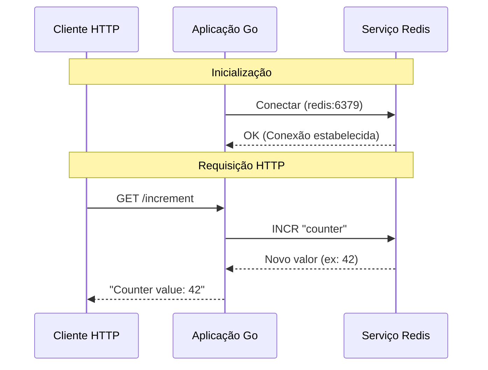
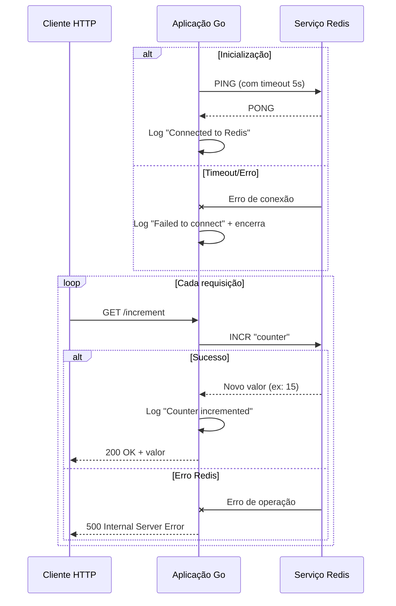

# Detalhes Técnicos - Go Redis MVP

Este documento explica em detalhes a implementação, tecnologias e decisões arquiteturais do projeto.

## Arquitetura do Sistema

O sistema consiste em dois serviços principais:

1. **Aplicação Go**: Servidor HTTP que expõe o endpoint `/increment`
2. **Redis**: Serviço de banco de dados em memória para armazenamento do contador

A comunicação entre os serviços ocorre através de uma rede Docker dedicada.

## Análise do Código

### `main.go`

#### Inicialização do Redis

```go
func initRedis() {
    rdb = redis.NewClient(&redis.Options{
        Addr:     "redis:6379", // Usa o nome do serviço do compose
        Password: "",           // Sem autenticação
        DB:       0,            // Banco padrão
    })

    // Testa a conexão com timeout
    ctx, cancel := context.WithTimeout(context.Background(), 5*time.Second)
    defer cancel()

    _, err := rdb.Ping(ctx).Result()
    if err != nil {
        log.Fatalf("Failed to connect to Redis: %v", err)
    }
}
```
- *redis.NewClient*: Cria um novo cliente Redis usando o endereço do serviço no Docker Compose.
- *rdb.Ping*: Verifica se a conexão com o Redis está ativa com um timeout de 5 segundos

#### Handler de Incremento

```go
func incrementHandler(w http.ResponseWriter, r *http.Request) {
    ctx := context.Background()
    
    // Incrementa o contador atomicamente
    counter, err := rdb.Incr(ctx, "counter").Result()
    if err != nil {
        http.Error(w, err.Error(), http.StatusInternalServerError)
        return
    }

    fmt.Fprintf(w, "Counter value: %d\n", counter)
}
```
- *rdb.Incr*: Comando Redis que incrementa atomicamente o valor da chave "counter"
- *Result()*: Retorna o novo valor após o incremento

### Dockerfile

O Dockerfile utiliza multi-stage build para reduzir o tamanho da imagem final:
1. Estágio de Build: Usa a imagem golang:1.24-alpine para compilar a aplicação
2. Estágio de Runtime: Usa alpine:latest (imagem mínima) para executar o binário compilado

### docker-compose.yml
Configuração dos serviços:
- *app*: Serviço da aplicação Go
    - Expõe a porta 8080
    - Depende do serviço Redis
    - Usa a rede personalizada go-redis-net

- *redis*: Serviço do Redis
    - Usa a imagem redis:alpine (leve)
    - Configura volume para persistência de dados
    - Implementa health check para verificar disponibilidade

## Decisões Técnicas
1. *Redis como Armazenamento:*
    - Escolhido por sua performance e atomicidade nas operações
    - Comando INCR é atômico, ideal para contadores

2. *Timeout na Conexão:*
    - Implementado para evitar que a aplicação fique bloqueada caso o Redis não esteja disponível

3. *Health Check no Redis:*
    - Garante que a aplicação só inicie após o Redis estar pronto
    - Melhora a resiliência do sistema

4. *Multi-stage Build:*
    - Reduz significativamente o tamanho da imagem final
    - Remove dependências desnecessárias do runtime

5. *Rede Docker Dedicada:*
    - Isola a comunicação entre os serviços
    - Melhora a segurança e performance

## Diagramas

### Diagrama de Sequência


1. Fase de Inicialização:
    - A aplicação Go inicia a conexão com o Redis usando o endereço redis:6379

    - Redis responde com confirmação da conexão

2. Fase de Requisição:
    - Cliente faz uma requisição HTTP GET para /increment
    - A aplicação envia o comando INCR "counter" para o Redis
    - Redis incrementa o contador atomicamente e retorna o novo valor
    - Aplicação formata a resposta e envia para o cliente

### Diagrama de Sequência Detalhado (com tratamento de erros)

- Comunicação HTTP entre cliente e aplicação
- Comunicação via protocolo Redis entre aplicação e servidor
- Tratamento de erros em ambos os estágios
- Logging de operações importantes
- Timeout na fase de inicialização